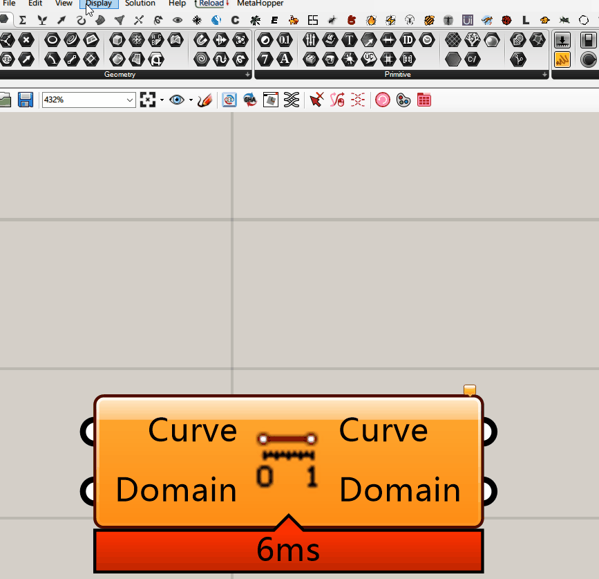
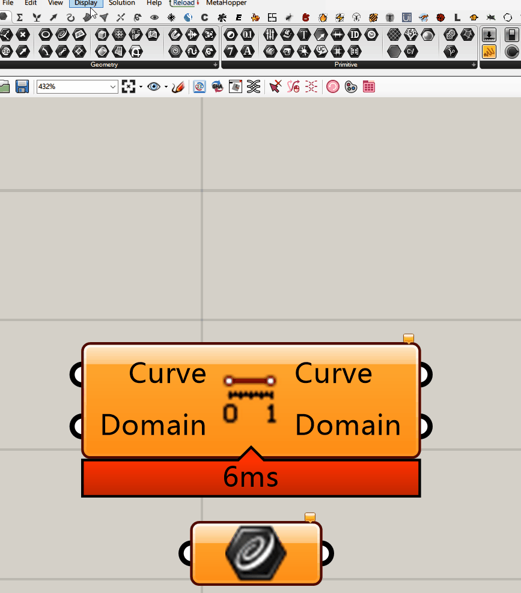
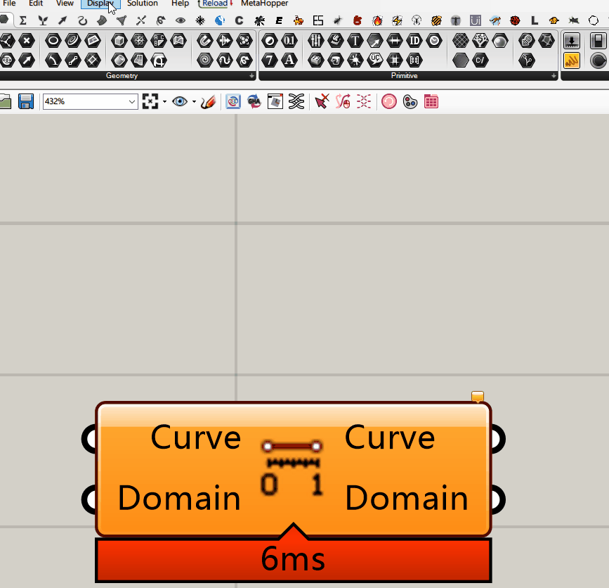
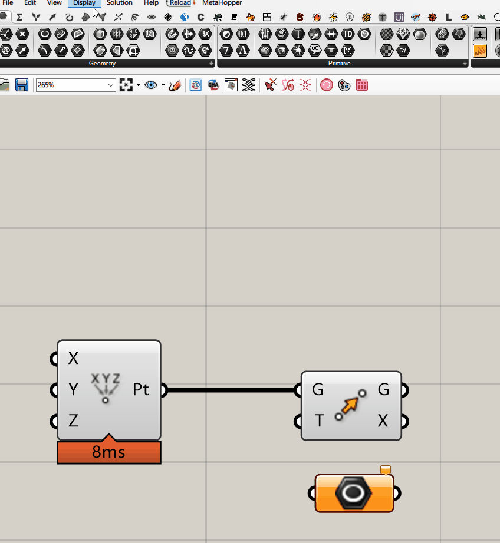
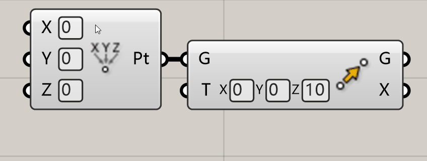
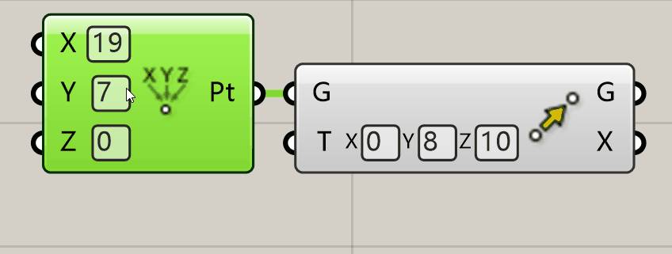
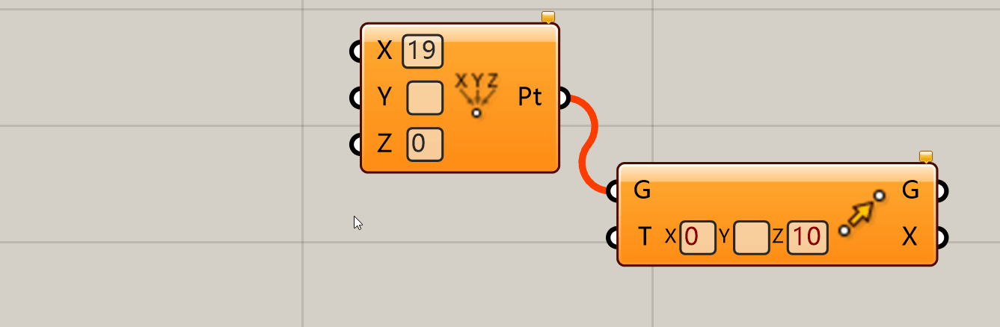
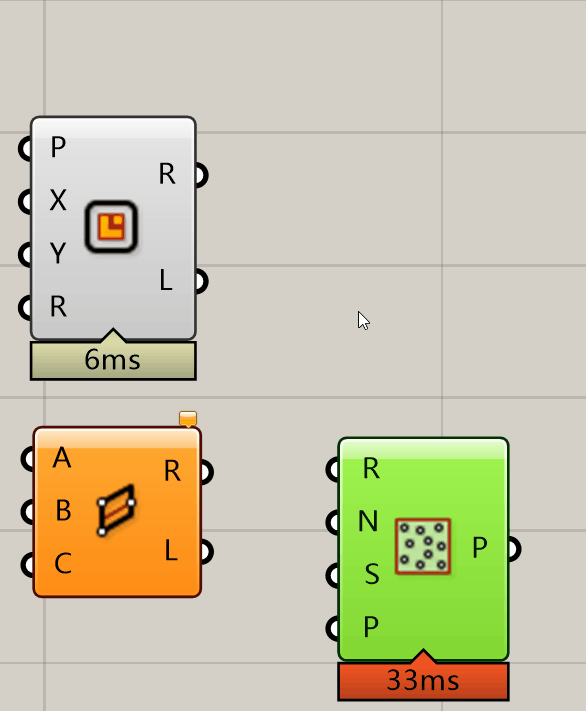

# Component Toolkit For Grasshopper
Make your Grasshopper workflow faster! Settings are under _Display_ Menu.

You can download in [Food4Rhino](https://www.food4rhino.com/en/app/persistent-data-editor).

# Layout

Under _Display_ menu, you can see a menu called _Component Toolkit_. You can set component's layout under this menu.

## Component's Param Name Alignment

Under _Component Toolkit_ menu, you can see two _Component Align Edge_ settings, so you can change component's param name alignment to align edge.

## Component & Param's Layout Parameters

You can change some parameters that affect the layout. Their effect is shown in the gif.

The _Param's Icon to Edge_ doesn't work so well, because the param has a minimum width valued with 50.

## Component's Param Icon

It is a novice friendly feature. You can add a icon on each params side, so you can easily know which type this param is.

Also you can change some parameters about this icon.

# Param's Control

This is the major feature. You can open or close it on the _Param's Control_ under the _Component's Toolkit_ Menu. You can also open the cotrol seperately, such as only open component's control but don't open param's control.

## Control Use

You can __Left Click__ the Control to reset the value, so it will set the persistent data in the params. So you can change value easily.

Also you can set empty value so that will clear the persistent value. If the persistent data is empty and control have written the value, the control will show in red.

You can __Right Click__ the Control to add a component to create this data just like the control do. Besides, it will set the data you've set in the one level up control.

## Control Layout

You can check the _Independent Width_ button to make the control and name set under different column.

You can check _Control Align Right_ button to make the control align right.

You can change _Component's Param to Control_ value to change params to control distance.

You can change _Param's Iton to Control_ value to change floating param's icon/name to control distance.

You can change _Max InputBox's Width_ value to change the single inputbox's max width.

You can also change Control's render colour.

## Choose Control

Under _Choose Control_ item, you can choose which control you want to use, and which one don't.

The controls are divided into three types, Single Control, One Line Control, Multi-line Control.

Single Control is the smallest control. One Line Control is a set of Single Control. Multi-line Control is a set of One Line Control.

Multi-Control can change the show type, so you can choose your favorate type to set the persistent data. It will also change the create component when __Right Click__.

# Quick Wire

You can check _Quick Wire_ button, to enable the quick wire tool. In this case, you can __Left Click__ the Component's Param or __Double Click__ the Floating Params To Open the Quick wire Menu.

If you __Double Click__ the Floating Param, you should choose whether you want to add active object as param's input or not.

In the menu, Icon it the icon of Active object it will change, so does name. The integer in square brackets, is the index of Component's Input or Output Param it will auto wire.

## Quick Wire Edit

When the menu is open, you can see a _Eidt_ button, when you click it, you will go in a editor window.

If you want to add a quick wire item, first you should click the _Add_ Button, then move your mouse to what param you want to add. In this case, you'will see a rectange, it is the param you selected if you __Left Click__. Green means the seleted param and your choose param are the same type, Orange means not. Last but not least, __Left Click__ the high light param you want.

Also, when you selected one item, you can make it up, down or remove.

In the end, please __Left Click__ _Ok_ button or close the window and save. If you only want to check the effect, you can __Left Click__ _Apply_ button. If you don't want to save it, just __Left Click__ _cancel_ button.

Your own settings will be saved at _Settings Folder_ named with quickwire.json. You can share your own quick wire sytle to others!

___
___

# Component Toolkit For Grasshopper
可以使你的Grasshopper工作效率更高! 设置在 _Display_ 菜单下。

你可以在[Food4Rhino](https://www.food4rhino.com/en/app/persistent-data-editor)中下载。

# 布局

在 _Display_ 菜单下，你可以找到一个叫 _Component Toolkit_ 的菜单。你可以在这个菜单下设置运算器的布局。

## 运算器中参数名称的对齐

在 _Component Toolkit_ 菜单下, 你可以看到两个 _Component Align Edge （运算器对齐）_ 设定，这样你可以设定运算器中参数名到运算器边缘的对齐。

## 运算器和参数的布局参数

你可以更改一些影响布局的参数。他们的影响你可以在下面的GIF中看到。

看起来似乎 _Param's Icon to Edge（参数图标到边缘）_ 并没工作的很好，这是因为参数有一个最小的宽度，值为50。

## 运算器参数图标

这是一个新手友好的功能。你可以给每个参数的边缘都添加一个参数的图标。这样你可以很方便的看到这个参数是什么类型。

同样的，你也可以修改一些关于这个图标的参数。

# 参数控制项

这是本插件的主要功能。你可以在 _Component's Toolkit_ 菜单下的 _Param's Control_ 中点开它。你也可以单独打开这些控制项，比如只开运算器的控制项，而不开参数的控制项。

## 控制项的使用

你可以 __左键__ 控制项修改数据，这会更改参数中的预设值。这样你可以更方便的更改数据。

同样的，你可以设定空值，这样就会清空预设值。如果预设值是空的，但是控制项已经写了一些数据，那么控制项目将会显示红色。

你可以 __右键__ 这些控制项，从而创建一个和控制项相似创建数据的运算器。另外他只会设定向上一层的控制项的值。

## 控制项布局

你可以点击 _Independent Width（独立宽度）_ 按钮，以让控制项和名称在不同的列中。

你可以点击 _Control Align Right（向右对齐）_ 按钮，让控制项向右对齐。

你也可以修改 _Component's Param to Control（运算器的参数到控制项的距离）_ 的数值从而修改运算器的参数到控制项的距离。 

你可以修改 _Param's Iton to Control（参数图标到控制项的距离）_ 的数值从而修改参数图标或者名称到控制项的距离。

你可以修改 _Max InputBox's Width（最大输入框宽度）_ 的数值，从而修改输入框的最大宽度。

你也可以修改控制项的渲染颜色。

## 选择控制项

在 _Choose Control（选择控制项）_ 菜单下，你可以选择哪个控制项你想要使用，哪个不需要。

这些控制项包含三种类型。分别是单一控制项，单行控制项和多行控制项。

单个控制项是最小的控制项。单行控制项是一组最小控制项。多行控制项是一组单行控制项。

多行控制项可以修改显示的类别。这样你可以选择你最喜欢的创建预设值的方式。同样的这个也会影响到 __右键__ 创建的运算器。

# 快速连线

你可以点击 _Quick Wire（快速连线）_ 按钮以开启这个功能。在这种情况下，你可以 __左键__ 运算的参数或者 __双击__ 参数来打开快速连线菜单。

如果你 __双击__ 参数，那么你需要选择你要在参数的输入端还是输出端添加运算器。

在这个菜单中，图标和名称都是即将要创建的运算器的。在方括号中的数字代表着要自动连线的运算器的参数的输入或输出端的序号。

## 快速连线编辑

当菜单是打开的时候，你可以看到一个 _Eidt（编辑）_ 按钮，当你点下它的时候，你会进入编辑窗口。

如果你想要添加快速连线，首先你需要点击 _Add（添加）_ 按钮，然后移动你的鼠标到你想要添加的参数上。这时你会看到一个方框，这个就是当你 __左键__ 后会获得的参数。绿色代表这两个参数是一个类型，橙色反之。最后，请 __左键__ 你想要的高亮参数。

同样的，当你选择一个项目的时候，你可以让他向上向下或者移除。

最后，请你 __左键__  _Ok（完成）_ 按钮或者关闭窗口以保存。如果你只想要看一下效果，你可以 __左键__  _Apply（实行）_ 按钮。如果你不想要保存它，那么只需要 __左键__  _Cancel（取消）_ 按钮。

你的设定将会被保存在 _Settings Folder_ 中，并以 quickwire.json 命名。你可以分享你自己的快速连线方案给别人！
